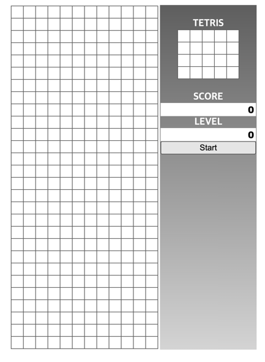
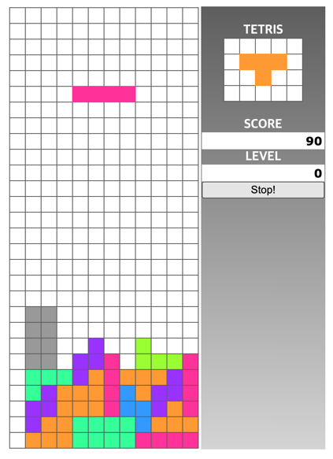

# Simple Tetris

## Synopsis

> Play simple Tetris.  
> Just open tetris html file on any browser.

## Manual
- `arrow key` : move the block by arrow key. 
- `space key` : Directly drop the block down.

## Screenshot
> You just click the `start button`.

> You can check your `score` and `level`.   
> Also you can see the next block in the upper right corner.   
> When the game level is up, the block `down speed` is up.   
> Enjoy Playing game.!   

